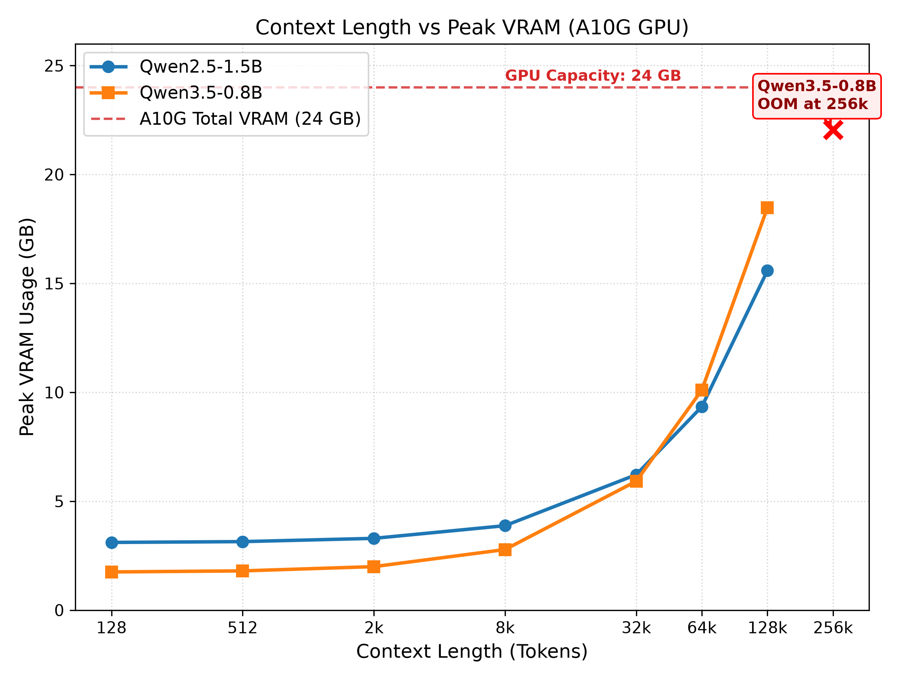

# KV Cache Scaling & Quantization Analysis

Benchmarking KV cache memory scaling with context length and KV quantization impact on **Qwen 2.5-1.5B** and **Qwen 3.5-0.8B**.

## Theoretical KV Cache per Token (BF16)
- **Qwen 2.5-1.5B** (Dense GQA, 28 attn layers, 2 KV heads, $d=128$): **28 KB / token**
- **Qwen 3.5-0.8B** (Hybrid, 6 attn layers, 2 KV heads, $d=256$): **12 KB / token**
> Calculations in [model.md](./src/increasing_context/model.md)
## Analysis

